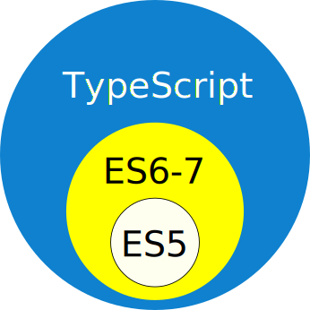

## Geoff Filippi

### Application Architect

---

# [Oildex](www.oildex.com)

A cloud service company for oil and gas

* 1 year

---

Formerly:

# [Time Warner Cable](www.timewarnercable.com)

* 12 years

---

## Experience

<i class="fa fa-phone"></i>

* Worked on streaming media (Voice over IP), 6 years
* 5 million phone customers

---

## Experience

<i class="fa fa-video-camera"></i>

* Worked on video and streaming video, 4 years

---

## Projects

[twctv.com](twctv.com)

* Video streaming website
 * backbone.js
* Video streaming Set-Top Box (STB) web application

---

## Oildex Projects

* Rewrite 10+-year-old apps
* Angular 2
* Typescript

---

---

# We will cover

* Background
* TypeScript
* Using TypeScript

---

# Background

---

## [JavaScript already has types](https://developer.mozilla.org/en-US/docs/Web/JavaScript/Data_structures)

* Primitives
 * `Boolean`
 * `Null`
 * `Undefined`
 * `Number`
 * `String`
 * `Symbol`
* `Object`

---

## [JavaScript uses a dynamic type system](https://developer.mozilla.org/en-US/docs/Web/JavaScript/Data_structures)

```
var foo = 42;    // foo is now a Number
var foo = "bar"; // foo is now a String
var foo = true;  // foo is now a Boolean
```

---

## [Duck Typing](https://en.wikipedia.org/wiki/Duck_typing)
The "type" of the value held in a variable is determined by runtime tests.

---

## Duck Typing Example

```javascript
function Duck() {
   this.quack = function() {
      console.log('Quack');
   };
}

function Cat() {
   this.meow = function() {
      console.log('Meow');
   };
}
```

---

## Duck Typing Example

```javascript
var daffy = new Duck();
var tabby = new Cat();

if (typeof daffy.quack === "function") {
   console.log("Daffy quacks like a duck");
} else {
   console.log("Daffy does not quack like a duck");
}

if (typeof tabby.quack === "function") {
   console.log("Tabby quacks like a duck");
} else {
   console.log("Tabby does not quack like a duck");
}
```

---

# TypeScript

---

## [TypeScript](https://www.typescriptlang.org/docs/tutorial.html)

>TypeScript is a typed superset of JavaScript that compiles to plain JavaScript.



---

### Because TypeScript is a superset of ES6-7, 
###it provides all of the same features.

```
const    let           =>                     class

super    Map           Set                    Promise 

**       ...[1,2,3]    function(a, ...args)   0o10

0b10     async         await                  @SomeDecorator

Observable
```

---

## TypeScript Understands JavaScript Types

* `Boolean`
* `Null`
* `Undefined`
* `Number`
* `String`
* `Symbol`

---

## TypeScript Additional Types

* `Tuple`
* `Enum`
* `Any`
* `Void`

---

## Additional Features of TypeScript

* Static Types
 * Variables
 * Parameters
 * Return Types
 * Implicit Types
* Interfaces
* Generics

---

### Explicit Types

#### Good

```
let myVar:string;

myVar = "hello";
```

---

### Explicit Types

#### Bad

```
let myVar:string;

myVar = 1;
```
```
explicit-types-bad.ts(3,1): error TS2322:
Type 'number' is not assignable to type 'string'.
```

---

### Implicit Types

#### Good

```
let myVar = "string";

myVar = "another string";
```

---

### Implicit Types

#### Bad

```
let myVar = "string";

myVar = 1;
```
```
implicit-types-bad.ts(3,1): error TS2322:
Type 'number' is not assignable to type 'string'.
```

---

### [Interfaces](https://www.typescriptlang.org/docs/handbook/interfaces.html)

```
interface LabelledValue {
    label: string;
}

function printLabel(labelledObj: LabelledValue) {
    console.log(labelledObj.label);
}

let myObj = {size: 10, label: "Size 10 Object"};
printLabel(myObj);
```

---

# Using TypeScript

---

## Install

```
npm install -g typescript
```

---

## Tooling

* IntelliSense
* Peeking
* Refactoring
* Reference Lookup

---

# Tooling Demo


---

## [`typings`](https://github.com/typings/typings)

---

## First Steps to TypeScript

### Start any new projects in TypeScript

---

## First Steps to TypeScript

### Legacy Code

---

## Add TypeScript support to existing IDE/Editor

---

## Bring in type definitions for your dependencies

---

## Manually Run the TypeScript compiler on your existing JavaScript

---

## Incorporate TypeScript into your build process

---

## Start adding TypeScript in your automated tests

---

## Use type annotations during debugging

---

## When a bug is found, add type checking to prevent regressions

---

## Concentrate on any library code or modules

---

## Replace any duck-typing code with formal types

---

# Questions?
